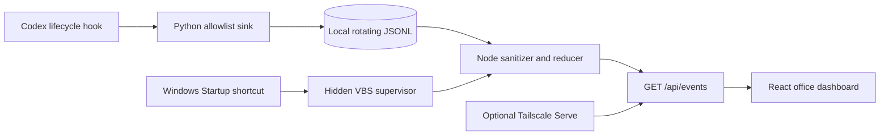

# Architecture

## Components

| Component | Responsibility | Trust boundary |
| --- | --- | --- |
| `codex/event_sink.py` | Accept hook JSON, keep allowlisted metadata, hash source IDs, rotate the event file | Runs locally from Codex user hooks |
| `server/events-reducer.mjs` | Validate records, derive employee/project state, create browser-facing opaque IDs | Rejects unknown fields before API output |
| `server/office-server.mjs` | Serve the production UI and `/api/events` | Binds to `127.0.0.1` only |
| `src/App.jsx` | Poll, filter, and visualize projects, employees, meetings, and activity | Receives only reduced API data |
| `scripts/install-windows.ps1` | Validate, install, merge hooks, create current-user autostart | Changes only the current user's configuration |
| `worker/index.js` | Serve static assets for a showcase | Demo-only; no access to local events |

## State derivation

- Main employee identity is derived from the session or project key.
- Subagent identity is derived from the already-hashed employee source ID.
- Two or more active employees in one project become `meeting`.
- `turn.stopping` becomes idle after a two-second quiet interval.
- A snapshot becomes stale after five minutes without a new event.
- The API returns at most the 80 most recent activities and reads at most 50,000 source events.

## Network model

The application has no public listener and no authentication layer. Localhost is therefore a deliberate security boundary. If remote access is enabled, the private overlay network must supply authentication and access control. Never place the server behind an unauthenticated public reverse proxy.
