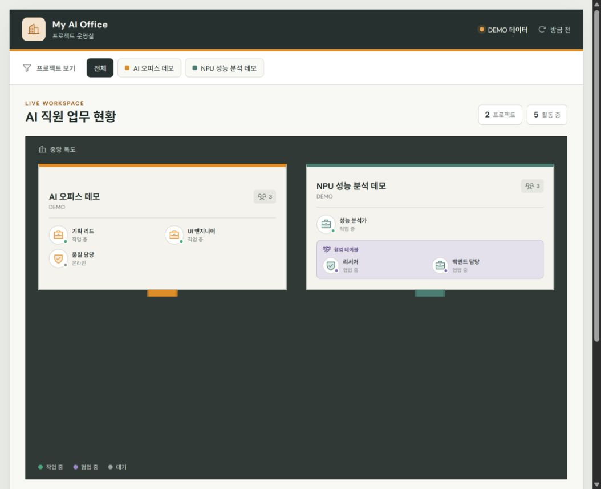
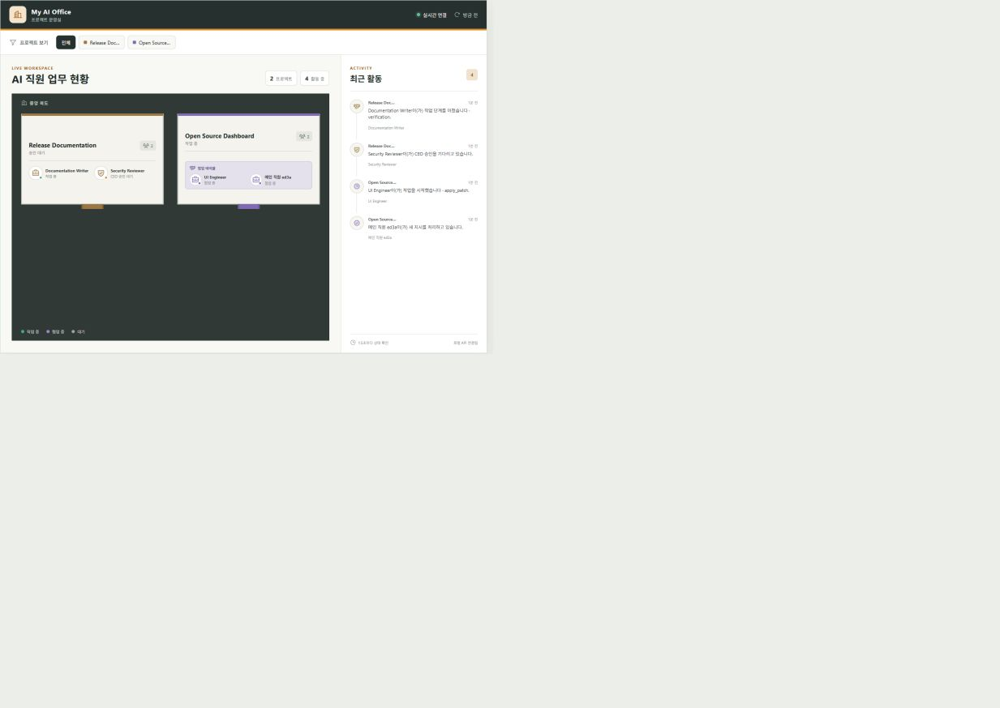

# Development Story

This document records how the prototype moved from a visual idea to a reusable local product. The reference supplied during design was used only as inspiration and is not redistributed in this repository.

## Stage 1 — Define the office metaphor

**Goal:** make multi-agent work understandable at a glance.

The initial concept was reduced to four visual rules: a dark office floor, one rectangular room per project, small employee markers, and a shared table for active collaboration. Decorative game scenery was deliberately excluded so status stayed readable.

**Result:** a responsive React layout with project filters, project rooms, employee states, a meeting table, and a recent-activity panel.

## Stage 2 — Build a deterministic demo

**Goal:** make the interface reviewable before any system-level integration.

The UI received explicit demo projects and events. Demo mode is clearly labelled and is used only when the live endpoint returns no valid events. This kept visual QA independent from Codex installation state.

**Result:** the public runtime capture below was produced by the real application with non-sensitive demo data.



## Stage 3 — Add the event pipeline

**Goal:** translate Codex lifecycle hooks into stable display state.

A Python hook sink accepts one JSON event on standard input and appends an allowlisted event to `~/.codex/ai-office/events.jsonl`. A Node reducer reads the current and one rotated JSONL file, validates each record, and derives projects, employees, activity messages, and status.

**Result:** main agents and functional subagents appear in the same project room while retaining distinct identities. A 20 MiB rotation limit prevents unbounded event-file growth.

## Stage 4 — Protect the local boundary

**Goal:** make the dashboard useful without turning prompts or tool activity into a surveillance log.

The event sink omits prompts, commands, tool input/output, file contents, credentials, full paths, and raw source identifiers. The reducer applies a second allowlist and creates opaque browser-facing IDs. The HTTP server binds only to `127.0.0.1`.

**Result:** tests confirm that private paths, raw worker/session IDs, prompts, and tool payloads do not reach `/api/events`.

## Stage 5 — Model collaboration and freshness

**Goal:** show teamwork and avoid presenting old data as current.

When at least two employees in a project are actively working, compacting, or stopping, the reducer marks those employees as collaborating and the UI places them at the meeting table. A snapshot remains fresh through exactly five minutes after the last event and becomes stale after that boundary.

Project rooms retain their previous positions while activity data changes. A newly observed project is appended without moving existing rooms, and a project moves behind active rooms only when all of its main sessions are offline. This prevents the 1.5-second polling cycle from turning activity updates into distracting layout changes.

Employee labels are derived from allowlisted role and tool categories, so framework labels such as `default` become functional names without reading prompts or transcripts. Completed subagents and ended main sessions remain visible for a 15-second handoff period and then leave the room; their completion events remain in recent activity. Employees without any activity for 30 minutes are also hidden as orphan cleanup and return automatically on their next event. Only an explicit restart event can return an explicitly completed employee to the room.

The activity panel keeps directives, assignments, handoffs, approvals, compaction, and session transitions as distinct events. Repeated tool start/finish events are grouped by employee and safe activity category until a 10-minute inactivity gap. Each card links the current CEO directive to a Korean work stage such as planning, investigation, implementation, collaboration, validation, or handoff, plus its duration and number of detailed steps. Project rooms also show the current directive and recent employee assignments.

Lifecycle-only sessions are now treated as simple chats and omitted until a tool, subagent, or approval event proves Codex work. A project leaves the office after 24 hours without activity and returns automatically with its next work event. The right panel has its own project selector so reviewing one project's history does not rearrange or narrow the office map.

Concrete text remains a local opt-in. When enabled, the sink stores only short, redacted Korean-safe summaries derived from user directives, allowlisted assignment/collaboration fields, and a subagent final handoff message. The API repeats the filtering, suppresses encrypted/identifier-like text, and converts known English work topics to Korean summaries. Meeting discussions appear only while at least two subagents collaborate. Shell/patch input, general tool I/O, and transcripts remain excluded.

**Result:** the office shows active collaboration, approval waits, quiet transitions, disconnected state, and stale state separately.



## Stage 6 — Run silently at sign-in

**Goal:** keep the dashboard available without a visible terminal.

The Windows installer builds and validates the app, installs the event sink, merges hook definitions with a backup, and creates a current-user Startup shortcut. The VBScript launcher resolves the repository location dynamically, avoids starting a second matching Node server, hides the window, and restarts the server after an unexpected exit.

**Result:** the local dashboard starts after Windows sign-in and remains recoverable with the foreground `npm run start:office` command.

## Stage 7 — Add private remote viewing

**Goal:** check the office from another personal device without exposing it publicly.

Tailscale Serve can proxy the loopback server inside a tailnet. Funnel is intentionally excluded. Static hosting remains demo-only because a hosted page cannot read the event file on a user's PC.

**Result:** local live operation and optional private remote operation have a clear security boundary. No personal tailnet address is stored in this repository.

## Stage 8 — Package for reuse

**Goal:** let another user clone, understand, install, validate, and remove the project.

The project now includes English and Korean entry documents, an MIT license, a repository map, privacy documentation, architecture notes, Windows install/uninstall scripts, staged development records, screenshots, and source-control exclusions for local data.

## Verification record

The release gate is:

```powershell
npm test
npm run build
```

Expected results:

- 38/38 Node tests pass.
- Vite production build succeeds.
- `dist/client/index.html`, `dist/server/index.js`, and `dist/.openai/hosting.json` are generated.
- The local server listens only on `127.0.0.1`.
- `GET /api/events` returns HTTP 200 in live or explicit demo mode.
- A repository-wide secret/path scan finds no personal machine path, email address, tailnet hostname, event log, or raw source identifier.

## Known limitations

- The UI is Korean-first; repository documentation is bilingual.
- Project folder names and agent role names are visible display metadata.
- Hook trust must be reviewed in Codex by the user.
- The packaged automatic installer targets Windows. Foreground Node operation is portable, but background startup scripts are not yet provided for macOS or Linux.
- Static hosting is a showcase, not a live remote dashboard.
- Hooks currently expose no reliable ChatGPT-versus-Codex product-source field. The dashboard therefore uses evidence of actual tool/subagent/approval work; a genuine text-only Codex task is intentionally hidden with other simple chats.
- Arbitrary English prose cannot be translated locally with guaranteed meaning. Known technical topics receive deterministic Korean summaries; otherwise the UI shows a Korean safe fallback instead of guessing or sending private text to an external translation service.
